# 🎓 BITS CS - Anie

### Your AI-Powered Academic Advisor for BITS Pilani Computer Science

 

**Calculate grades • Plan courses • Get career guidance**

[Use](https://cs.astralelite.org/chat) · [CONTRIBUTE](./CONTRIBUTING.md) ·  [Report Bug](../../issues) · [Request Feature](../../issues) · [Contact](./SUPPORT.md)

---

## 🔒 Privacy First

> **Your data stays with you.** All chat history is stored **locally in your browser** using IndexedDB. No conversation data is sent to any server for storage - only for generating responses. We don't track, store, or analyze your conversations.

---

## ✨ Features

<table>
<tr>
<td width="50%">

### 📊 Grade Calculator
- SGPA/CGPA computations with step-by-step breakdowns
- Automatic component weighting (Quizzes 30%, Assignments 20%, Compre 50%)
- Beautiful KaTeX math rendering

</td>
<td width="50%">

### 📚 Course Planning
- Complete 6-semester curriculum guide
- Prerequisites tracking
- Elective recommendations

</td>
</tr>
<tr>
<td width="50%">

### 🎯 Specialization Guidance
- Full-Stack Development path
- Cloud Computing track
- AI/ML specialization

</td>
<td width="50%">

### 💬 Conversational AI
- Natural language interactions
- Context-aware responses
- Persistent chat history (stored locally)

</td>
</tr>
<tr>
<td colspan="2">

### 🔑 Bring Your Own API Key (Optional)
- Use your own Gemini API key for direct access
- API key stored securely in your browser (localStorage)
- Choose from multiple Gemini models
- Green checkmark indicates custom API active

</td>
</tr>
</table>

---

## 🏗️ Architecture

### Dual Mode Operation

Users can choose between **Server API** (default) or **Custom API** (bring your own key):

```mermaid
flowchart TB
    subgraph Client["🖥️ Client (Browser)"]
        UI["⚛️ React App<br/>TypeScript + Vite"]
        IDB[("💾 IndexedDB<br/>Chat History")]
        LS[("🔑 localStorage<br/>API Key + Settings")]
        UI <--> IDB
        UI <--> LS
    end
    
    subgraph Mode1["Option 1: Server API"]
        BE["🐳 Backend Container<br/>Go + Gemini"]
    end
    
    subgraph Mode2["Option 2: Custom API"]
        DirectAPI["✨ Gemini API<br/>User's Own Key"]
    end
    
    UI -->|"Default"| BE
    UI -.->|"BYOK Mode"| DirectAPI
```

### Data Flow (Server Mode)

### Data Flow (Custom API Mode)

```mermaid
sequenceDiagram
    participant U as 👤 User
    participant F as ⚛️ Frontend
    participant LS as 🔑 localStorage
    participant DB as 💾 IndexedDB
    participant G as ✨ Gemini API
    
    U->>F: Send Message
    F->>LS: Get API Key
    LS-->>F: User's API Key
    F->>DB: Load Chat History
    DB-->>F: Previous Messages
    F->>G: Direct API Call
    G-->>F: AI Response
    F->>DB: Save Message
    F-->>U: Display Response
```

### Local Data Storage

---

## 🔐 Security

| Component | Security Measure |
|-----------|-----------------|
| **API Key** | Environment variables, never in code |
| **Backend** | Non-root container, read-only filesystem |
| **Frontend** | No secrets, static files only |
| **HTTPS** | Enforced on all endpoints |
| **Scanning** | CodeQL, TruffleHog, Dependabot |

> 📖 See [SECURITY.md](./SECURITY.md) for full security policy

---

## 🎨 Tech Stack

<table>
<tr>
<td align="center" width="96">

 React
</td>
<td align="center" width="96">

 TypeScript
</td>
<td align="center" width="96">

 Vite
</td>
<td align="center" width="96">

 Go
</td>
<td align="center" width="96">

 GCP
</td>
<td align="center" width="96">

 Firebase
</td>
</tr>
</table>

---

## 📊 BITS CS Curriculum Overview

The system contains complete curriculum data for:

| Program | Duration | Units |
|---------|----------|-------|
| B.Sc. CS (Online) | 3 years | 107 |
| B.Sc. Honours CS | 4 years | 144 |

### Specializations Available (Honours)

| Track | Focus Areas |
|-------|-------------|
| 🖥️ **Full-Stack** | React, Node.js, APIs, DevOps |
| ☁️ **Cloud** | AWS/GCP, Kubernetes, Microservices |
| 🤖 **AI/ML** | Machine Learning, Deep Learning, NLP |

---

## 🌸 Contributing

We'd love your help! Check out our [Contributing Guide](CONTRIBUTING.md) to get started.

---

## 📝 License

This project is licensed under the GNU General Public License v3.0 - see the [LICENSE](LICENSE) file for details.

This means you can freely use, modify, and distribute this software, but any derivative work must also be released under GPL 3.0.

---

## 🙏 Acknowledgments

- [BITS Pilani](https://online-programs.bits-pilani.ac.in/) for the curriculum data
- [Google Gemini](https://ai.google.dev/) for the AI capabilities
- [Firebase](https://firebase.google.com/) for hosting

---

**Made with ❤️ for BITS Students**

 

If this helped you, consider giving it a ⭐

