<div align="center">

# 🎓 BITS CS - Anie

### Your AI-Powered Academic Advisor for BITS Pilani Computer Science

[](https://www.gnu.org/licenses/gpl-3.0)
[](https://golang.org/)
[](https://reactjs.org/)
[](https://www.typescriptlang.org/)
[](https://cloud.google.com/)
[](https://ai.google.dev/)

<br/>


**Calculate grades • Plan courses • Get career guidance**

[Live Demo](https://bits-cs-ef66a.web.app) · [Report Bug](../../issues) · [Request Feature](../../issues)

</div>

---

## 🔒 Privacy First

> **Your data stays with you.** All chat history is stored **locally in your browser** using IndexedDB. No conversation data is sent to any server for storage - only for generating responses. We don't track, store, or analyze your conversations.

---

## ✨ Features

<table>
<tr>
<td width="50%">

### 📊 Grade Calculator
- SGPA/CGPA computations with step-by-step breakdowns
- Automatic component weighting (Quizzes 30%, Assignments 20%, Compre 50%)
- Beautiful KaTeX math rendering

</td>
<td width="50%">

### 📚 Course Planning
- Complete 6-semester curriculum guide
- Prerequisites tracking
- Elective recommendations

</td>
</tr>
<tr>
<td width="50%">

### 🎯 Specialization Guidance
- Full-Stack Development path
- Cloud Computing track
- AI/ML specialization

</td>
<td width="50%">

### 💬 Conversational AI
- Natural language interactions
- Context-aware responses
- Persistent chat history (stored locally)

</td>
</tr>
</table>

---

## 🏗️ Architecture

```mermaid
flowchart TB
    subgraph Client["🖥️ Client (Browser)"]
        UI["⚛️ React App<br/>TypeScript + Vite"]
        IDB[("💾 IndexedDB<br/>Chat History")]
        UI <--> IDB
    end
    
    subgraph Firebase["☁️ Firebase Hosting"]
        CDN["🌐 Global CDN"]
    end
    
    subgraph GCP["☁️ Google Cloud Platform"]
        CF["⚡ Cloud Function<br/>Go 1.23"]
        SM["🔐 Secret Manager<br/>API Keys"]
        CF --> SM
    end
    
    subgraph AI["🤖 AI Service"]
        Gemini["✨ Gemini Flash<br/>1M Token Context"]
        SP["📋 System Prompt<br/>BITS Curriculum Data"]
        Gemini --> SP
    end
    
    CDN --> UI
    UI -->|"HTTPS POST"| CF
    CF -->|"Generate"| Gemini
    Gemini -->|"Response"| CF
    CF -->|"JSON"| UI
```



### Data Flow


### Local Data Storage


---

## 🚀 Quick Start

### Prerequisites

- [Node.js](https://nodejs.org/) 18+
- [Go](https://golang.org/) 1.23+
- [Google Cloud CLI](https://cloud.google.com/sdk)
- [Gemini API Key](https://makersuite.google.com/app/apikey)

### 1️⃣ Clone the Repository

```bash
git clone https://github.com/yourusername/bits-cs.git
cd bits-cs
```

### 2️⃣ Frontend Setup

```bash
cd frontend
npm install

# Create environment file
cp .env.example .env
# Edit .env with your API URL

npm run dev
```

### 3️⃣ Backend Setup

```bash
cd backend
go mod tidy

# Set your Gemini API key
export GEMINI_API_KEY=your_key_here

# Run locally (optional)
go run .
```

### 4️⃣ Deploy

```bash
# Deploy backend to Google Cloud
cd backend
./deploy.ps1  # Windows
# OR
./deploy.sh   # Linux/Mac

# Deploy frontend to Firebase
cd ../frontend
npm run build
firebase deploy --only hosting
```

---

## 🔐 Security

| Component | Security Measure |
|-----------|-----------------|
| **API Key** | Stored in GCP Secret Manager, never in code |
| **Frontend** | No secrets, only public API URL |
| **Backend** | Secrets injected at runtime via `--set-secrets` |
| **HTTPS** | Enforced on all endpoints |
| **CORS** | Configured for allowed origins |

### ⚠️ Important

- **Never commit `.env` files** - They're in `.gitignore`
- **Use `.env.example`** as a template
- **API keys** should only be in GCP Secret Manager

---

## 🎨 Tech Stack

<table>
<tr>
<td align="center" width="96">

<br>React
</td>
<td align="center" width="96">

<br>TypeScript
</td>
<td align="center" width="96">

<br>Vite
</td>
<td align="center" width="96">

<br>Go
</td>
<td align="center" width="96">

<br>GCP
</td>
<td align="center" width="96">

<br>Firebase
</td>
</tr>
</table>

---

## 📊 BITS CS Curriculum Overview

The system contains complete curriculum data for:

| Program | Duration | Units |
|---------|----------|-------|
| B.Sc. CS (Online) | 3 years | 107 |
| B.Sc. Honours CS | 4 years | 144 |

### Specializations Available (Honours)

| Track | Focus Areas |
|-------|-------------|
| 🖥️ **Full-Stack** | React, Node.js, APIs, DevOps |
| ☁️ **Cloud** | AWS/GCP, Kubernetes, Microservices |
| 🤖 **AI/ML** | Machine Learning, Deep Learning, NLP |

---

## 🤝 Contributing

Contributions are welcome! Please feel free to submit a Pull Request.

1. Fork the repository
2. Create your feature branch (`git checkout -b feature/AmazingFeature`)
3. Commit your changes (`git commit -m 'Add some AmazingFeature'`)
4. Push to the branch (`git push origin feature/AmazingFeature`)
5. Open a Pull Request

---

## 📝 License

This project is licensed under the GNU General Public License v3.0 - see the [LICENSE](LICENSE) file for details.

This means you can freely use, modify, and distribute this software, but any derivative work must also be released under GPL 3.0.

---

## 🙏 Acknowledgments

- [BITS Pilani](https://www.bits-pilani.ac.in/) for the curriculum data
- [Google Gemini](https://ai.google.dev/) for the AI capabilities
- [Firebase](https://firebase.google.com/) for hosting

---

<div align="center">

**Made with ❤️ for BITS Students**

 

If this helped you, consider giving it a ⭐

</div>
